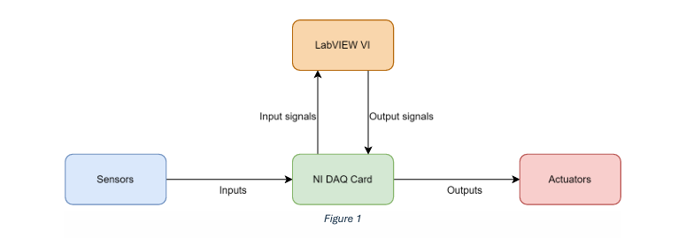
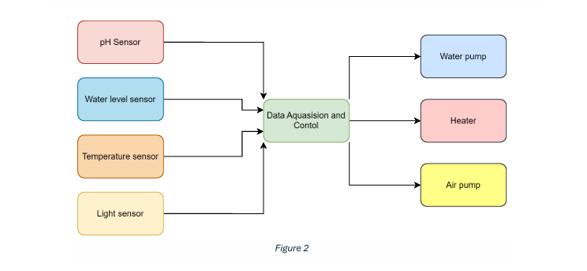
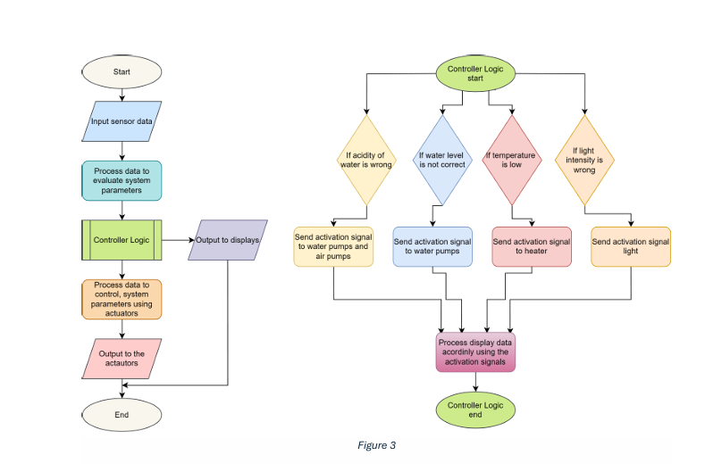

# EE 2044 – Electrical Measurements and Instrumentation

**Smart Tank Management System for the Ornamental Fish Industry**  
**Project Proposal**

**Krishanth M. – 220329M**  
**Kularathna A. K. D. D. D. – 220332P**  
**Kulasingha K. S. L. – 220333U**

---

## 1. Introduction

This proposal presents a Smart Tank Management System designed to automate the monitoring and control of environmental parameters in ornamental fish tanks. By using a National Instruments DAQ card and LabVIEW software, the system aims to enhance fish health, reduce operational costs, and strengthen Sri Lanka’s competitive edge in the global ornamental fish market.

## 2. Background and Context

Breeders, collectors, exporters, and retailers are all involved in the ornamental fish industry, which takes advantage of Sri Lanka's biodiversity and tropical climate. Notwithstanding its advantages, the sector faces difficulties due to stringent laws that require health certifications from the National Aquaculture Development Authority (NAQDA) to certify fish safety. Maintaining stable pH, avoiding temperature fluctuations, and ensuring adequate oxygenation are the main challenges. The absence of infrastructure for mass breeding hinders growth, even with decreased biosecurity threats. Studies indicate that technological intervention is necessary to help the industry overcome these challenges.

The Smart Tank Management System is proposed to overcome these challenges by automating water quality and tank maintenance, consolidating industry strengths—skillful breeders and government support—to attain sustainable growth and fulfill international demand.

## 3. Objectives

- Develop a Smart Tank Management System to monitor and control key tank parameters (pH, water level, temperature, light).  
- Enhance fish health and survival rates through real-time environmental adjustments.  
- Increase production efficiency and reduce labor costs for breeders and exporters.

## 4. Project Scope

This project will:

- Design and construct a prototype of the Smart Tank Management System using a National Instruments DAQ card and LabVIEW.  
- Conduct a pilot test with a lab-built setup.  
- Validate the system’s effectiveness in improving fish quality and operational efficiency.  
- Evaluate scalability for potential industry-wide adoption.

## 5. Methodology

### 5.1 System Components

**Sensors**  
- pH sensor: Monitors water acidity.  
- Water level sensor (Ultrasonic HC‑SR04): Ensures appropriate water levels.  
- Temperature sensor (DS18B20): Tracks water temperature.  
- Light sensor (LDR module or custom): Measures ambient light conditions.

**Actuators**  
- Water pump: Facilitates water circulation and filtration.  
- Heater: Regulates water temperature.  
- Air pump: Maintains dissolved oxygen levels.

**Additional Components**  
- LED light: Adjusts ambient light intensity.  
- Display: OLED or LCD screen for real-time data visualization.  
- User Interface: Buttons for manual initialization or overrides.

### 5.2 System Operation

1. **Data Acquisition**  
   Sensors connect to the DAQ card’s analog input channels, continuously collecting data on tank conditions.

2. **Control Logic**  
   LabVIEW uses DAQmx functions to acquire sensor data, process it, and execute control algorithms to maintain optimal parameters.  
   - Activate heater if temperature drops below threshold.  
   - Turn on water pump if water level is low.  
   - Engage air pump if oxygen levels decrease.

3. **LED Light Control**  
   Adjust LED light intensity according to sensor data.

### 5.3 System Diagrams

  
*Figure 1: Overall system block diagram.*

  
*Figure 2: Example LabVIEW front panel.*

  
*Figure 3: Photo of hardware prototype.*

## 6. Bill of Materials (Estimated)

| Item No. | Component                                   | Supplier / Website                                                                                                  | Unit Price (LKR) | Qty | Subtotal (LKR) |
| -------- | ------------------------------------------- | ------------------------------------------------------------------------------------------------------------------- | ---------------- | --- | -------------- |
| 1        | DS18B20 Waterproof Temperature Probe        | [Duino.lk](https://www.duino.lk/product/digital-waterproof-temperature-probe-ds18b20/)                              | 200.00           | 1   | 200.00         |
| 2        | DS18B20 Temperature Sensor Module (KY‑001)  | [Tronic.lk](https://tronic.lk/product/ds18b20-temperature-sensor-module-ky-001/)                                    | 230.00           | 1   | 230.00         |
| 3        | HC‑SR04 Ultrasonic Distance Sensor          | [Duino.lk](https://www.duino.lk/product/ultrasonic-sensor-module-hc-sr04/)                                          | 350.00           | 1   | 350.00         |
| 4        | Non‑contact Liquid Level Sensor (XKC‑Y25‑V) | [NilambaraElectronics](https://nilambaraelectronics.com/product/xkc-y25-v-intelligent-non-contact-liquidlevel-sensor/) | 450.00           | 1   | 450.00         |
| 5        | LDR Light‑Dependent Resistor Module         | [Duino.lk](https://www.duino.lk/product/photoresistor-ldr-light-sensitive-sensor-module/)                           | 150.00           | 1   | 150.00         |
| 6        | 0.96″ I²C OLED Display Module               | [Duino.lk](https://www.duino.lk/product/0-96-inch-oled-display-module-i2c/)                                        | 650.00           | 1   | 650.00         |
| 7        | Tactile Push-Buttons (pack of 5)            | [Duino.lk](https://www.duino.lk/product/tactile-switch-module-pack-of-5/)                                          | 300.00           | 1   | 300.00         |
| 8        | pH Electrode Probe (BNC connector)          | [NilambaraElectronics](https://nilambaraelectronics.com/product/ph-electrode-probe-bnc/)                           | 1,600.00         | 1   | 1,600.00       |
| 9        | Analog pH Sensor Module (no probe)          | [NilambaraElectronics](https://nilambaraelectronics.com/product/ph-sensor-module/)                                 | 4,200.00         | 1   | 4,200.00       |
|          | **Subtotal (sensors & UI)**                 |                                                                                                                     |                  |     | **8,130.00**   |
| 10       | Submersible Water Pump                      | TBD – source via Daraz.lk or local market                                                                          | TBD              | 1   | TBD            |
| 11       | Aquarium Heater                             | TBD – source via Daraz.lk or local market                                                                          | TBD              | 1   | TBD            |
| 12       | Aquarium Air Pump                           | TBD – source via Daraz.lk or local pet store                                                                        | TBD              | 1   | TBD            |
|          | **Estimated for actuators**                 |                                                                                                                     |                  |     | **≈ 4,500.00** |
|          | **GRAND TOTAL (approx.)**                   |                                                                                                                     |                  |     | **12,630.00**  |

## 7. Timeline (Estimated)

| Phase               | Duration | Activities                          |
| ------------------- | -------- | ----------------------------------- |
| Research & Design   | 1 week   | System design, requirements analysis |
| Development         | 3 weeks  | Hardware/software assembly          |
| Testing & Validation| 2 weeks  | Pilot testing, performance analysis |
| Implementation      | 1 week   | Deployment, scalability planning    |

## 8. Conclusion

The Smart Tank Management System tackles critical challenges in Sri Lanka’s ornamental fish industry by automating tank management and ensuring high-quality fish for export. It leverages skilled expertise and government support while addressing infrastructure weaknesses. With growing global demand, this system promises to enhance the efficiency and competitiveness of ornamental fish production.

## 9. References

1. Sri Lanka Export Development Board (EDB), "Industry Capability Report: The Ornamental Fish Industry in Sri Lanka," Colombo, Sri Lanka, Mar. 2025.  
2. P. P. M. Heenatigala, "Study of the constraints affecting ornamental fish production in Sri Lanka," *Journal of the National Aquatic Resources Research and Development Agency*, vol. 41, pp. 5–22, 2012.  
3. W. A. R. N. Weerasinghe *et al.*, "Current status and future prospect of the ornamental fish: A case of Colombo District, Sri Lanka," in *Climatic Changes…*, NASTEC, 2024, pp. 233–250.  
4. D. Stachowiak and P. Hemmerling, "Development of an Automatic Water Exchange System for Smart Freshwater Aquarium," *Electronics*, vol. 11, no. 17, p. 2705, Aug. 2022.  
5. M. Z. Abdul Rahman and K. Rajendra, "Smart Aquarium Monitoring System (SAMS)," *Jurnal Kejuruteraan, Teknologi dan Sains Sosial*, vol. 10, no. 1, pp. 72–79, Jun. 2024.  
6. S. Fu *et al.*, "Research and design of an intelligent fish tank system," *PLoS ONE*, vol. 18, no. 5, Art. e0285105, May 2023.  

## Project Phase Checklist

### Phase 1: Research & Design ✅
- [x] Define system requirements  
- [x] Perform literature review  
- [x] Identify sensors & actuators  
- [x] Draft system block diagram  
- [x] Finalize hardware/platform selection  
- [x] Review & sign‑off design document

### Phase 2: Development
- [x] Design the system in LabVIEW
- [x] Order components & tools  
- [x] Assemble hardware prototype with Arduino Simulator  
- [x] Wire up sensors to NI DAQ 
- [x] Develop LabVIEW acquisition logic for NI DAQ card
- [x] Implement control algorithms  
- [x] Integrate UI (LCD + buttons)  
- [x] Internal code review & testing  

### Phase 3: Testing & Validation
- [ ] Design test cases for each sensor  
- [ ] Validate pH sensing accuracy  
- [ ] Verify water‑level detection  
- [ ] Test temperature control loop  
- [ ] Check LED light adjustment  
- [ ] Run end‑to‑end pilot trial  
- [ ] Log results & troubleshoot issues  
- [ ] Update documentation with test data

### Phase 4: Implementation
- [ ] Deploy prototype in real tank setup  
- [ ] Train end‑users on system operation  
- [ ] Collect user feedback  
- [ ] Refine software & hardware as needed  
- [ ] Document deployment steps  
- [ ] Final sign‑off & handover

---
